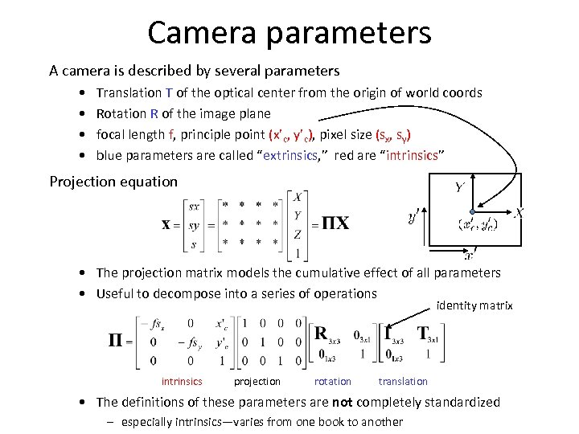
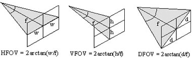
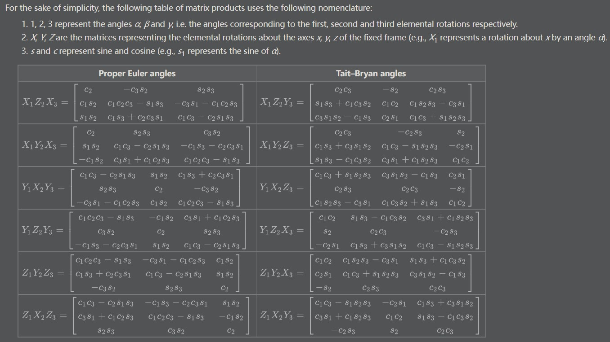

#

## Camera





[OpenCV Camera](https://docs.opencv.org/4.x/d9/d0c/group__calib3d.html)

## Coordinate System

[LHC vs. RHC](https://www.evl.uic.edu/ralph/508S98/coordinates.html)

[Euler Angles](https://mathworld.wolfram.com/EulerAngles.html)

[Euler Angles#Rotation Matrices](https://en.wikipedia.org/wiki/Euler_angles#Rotation_matrix)

[Unity Euler Angles](https://docs.unity3d.com/ScriptReference/Transform-eulerAngles.html)



Camera Euler Angle: ZXY (yaw-pitch-roll) convention (from Unity)

[Unity Rotations](https://en.wikibooks.org/wiki/Cg_Programming/Unity/Rotations)

[HoloLens Spatial Coordinate Systems](https://docs.microsoft.com/en-us/windows/mixed-reality/design/coordinate-systems#spatial-coordinate-systems)

*Spatial coordinate systems on Windows are always right-handed, which means that the positive X-axis points right, the positive Y-axis points up (aligned to gravity) and the positive Z-axis points towards you.* --MS DOC

## HoloLens 2

[Locatable Camera](https://docs.microsoft.com/en-us/windows/mixed-reality/develop/advanced-concepts/locatable-camera-overview)

[Detailed DOC](https://github.com/MicrosoftDocs/mixed-reality/blob/a0b2c53dc2/mixed-reality-docs/locatable-camera.md)

- W: 2272
- H: 1278
- HFOV: 64.69

[Camera Intrinsics](https://forums.hololens.com/discussion/2581/locatable-camera-augmented-reality-rendering)

[Pixel to World](https://forums.hololens.com/discussion/3117/pixel-coordinates-to-world-coordinates)

[HoloLens2 Unity](https://stackoverflow.com/questions/63193233/hololens-2-unity-how-to-use-the-cameratoworldmatrix-to-correct-the-position)

[QR Code Demo](https://localjoost.github.io/Positioning-QR-codes-in-space-with-HoloLens-2-building-a-'poor-man's-Vuforia'/)

[VulcanTechnologies/HoloLensCameraStream](https://github.com/VulcanTechnologies/HoloLensCameraStream/blob/master/HoloLensVideoCaptureExample/Assets/CamStream/Scripts/LocatableCameraUtils.cs)

[PhotoCapture](https://forum.unity.com/threads/holographic-photo-blending-with-photocapture.416023/)

[HoloLensCamera](https://github.com/microsoft/MixedReality-SpectatorView/blob/master/src/SpectatorView.Unity/Assets/PhotoCapture/Scripts/HoloLensCamera.cs#L1256)

## Data Transform

[CameraToWorldMatrix](https://docs.unity3d.com/ScriptReference/Camera-cameraToWorldMatrix.html)

[WorldToCameraMatrix](https://docs.unity3d.com/ScriptReference/Camera-worldToCameraMatrix.html)

[HoloLens2ForCV](https://github.com/microsoft/HoloLens2ForCV/blob/main/Samples/StreamRecorder/StreamRecorderConverter/save_pclouds.py#L217)

[Unity CameraToWorld Documented](https://forum.unity.com/threads/where-is-unity_cameratoworld-documented.908183/)

```sh
NITY_MATRIX_V == cam.worldToCameraMatrix

UNITY_MATRIX_I_V == cam.cameraToWorldMatrix

unity_WorldToCamera == Matrix4x4(cam.transform.position, cam.transform.rotation, Vector3.one)

unity_CameraToWorld == Matrix4x4(cam.transform.position, cam.transform.rotation, Vector3.one).inverse
```

```sh
// HoloLens projection matrix
m11 m12 m13 m14 // a  0  b  0
m21 m22 m23 m24 // 0  c  d  0
m31 m32 m33 m34 // 0  0 -1  0
m41 m42 m43 m44 // 0  0 -1  0

// OpenCV
fx 0  cx
0  fy cy
0  0  1

// transform
cx = half_width + half_width * b
fx = a * half_width
cy = half_height + half_height * d
fy = c * half_height

// HoloLens CameraToWorld matrix
m11 m12 m13 m14 //  x  x  x  t1
m21 m22 m23 m24 //  x  x  x  t2
m31 m32 m33 m34 //  x  x  x -t3
m41 m42 m43 m44 //  0  0  0  1
```

```sh
Projection Matrix:
1.53862 0.00000  0.00729 0.00000
0.00000 2.73525 -0.05193 0.00000
0.00000 0.00000 -1.00000 0.00000
0.00000 0.00000 -1.00000 0.00000

CameraToWorld Matrix:
 0.99903 0.03822 -0.02210 0.01095
-0.03472 0.98934  0.14145 0.10689
-0.02727 0.14054 -0.98970 0.16761
 0.00000 0.00000  0.00000 1.00000

WorldPosition:
(0.011, 0.107, 0.168)
WorldEulers:
(8.132, 1.279, 357.990)
```

use Euler angles instead of CameraToWorld Matrix for rotation calculation:

- Unity LHC to RHC: -alpha, -beta, +gamma
- XYZ rotation requires rotating 180 degrees along x-axis first

after transform:

```sh
 0.01095     0.10689    0.16761    // t1, t2, t3
 0.999136   -0.0378768  0.0171215  // r1
-0.0350653  -0.989225  -0.142142   // r2
 0.0223209   0.141419  -0.989698   // r3
1747.8723                          // fx
1747.8248                          // fy
1144.2814                          // cx
605.8167                           // cy
1278                               // height
2272                               // width
```
